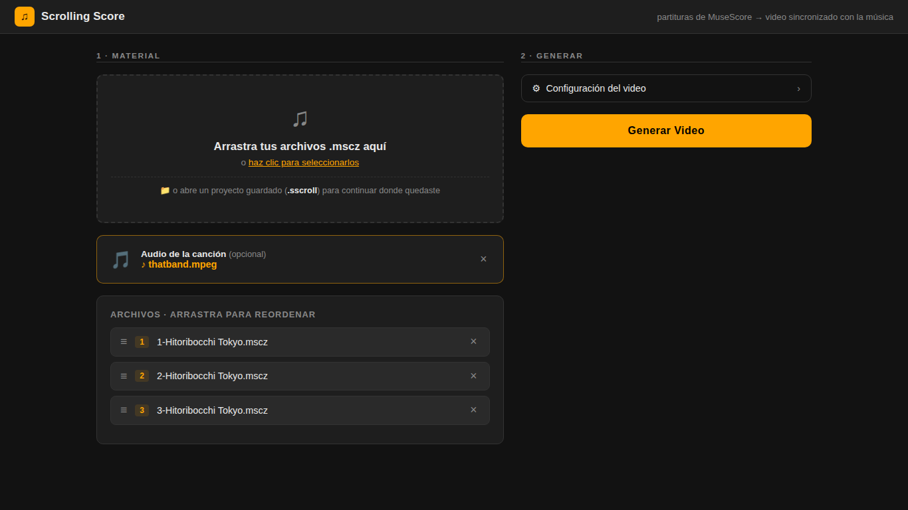
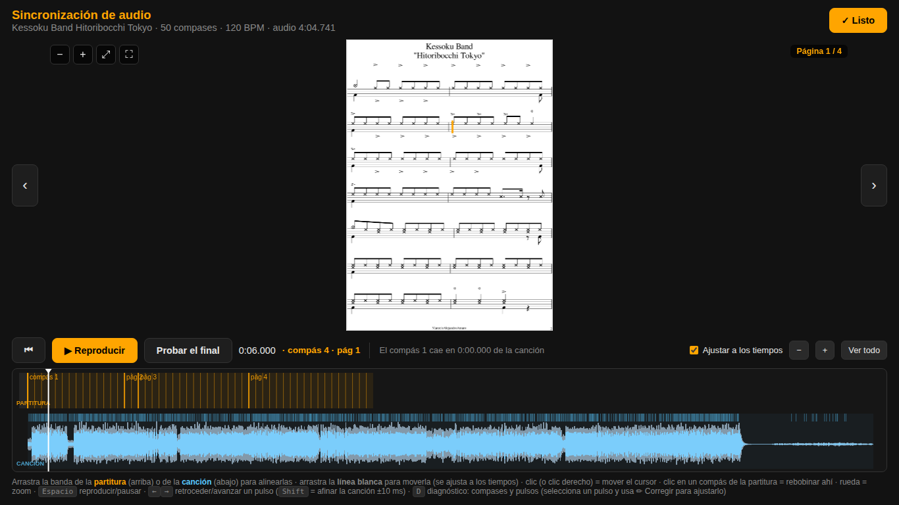

<p align="center">
  
</p>

<h1 align="center">♪ Scrolling Score</h1>

<p align="center">
  Generador de videos de partitura con desplazamiento sincronizado al audio,
  a partir de archivos de MuseScore.
</p>

<p align="center">
  <a href="LICENSE"></a>
  
  
</p>

---

> **In English:** Scrolling Score converts MuseScore sheet music (`.mscz`)
> into a scrolling sheet-music video synchronized with the song's real audio
> recording, and exports it as MP4. It includes a browser-based
> synchronization editor with beat-accurate alignment and per-note
> fine-tuning. Local Flask application; AGPL-3.0.

## Descripción

Scrolling Score toma las hojas de una partitura (`.mscz`) y el audio de la
canción, renderiza la partitura mediante MuseScore y produce un video MP4 en
el que una línea lectora recorre la partitura en sincronía con la grabación.
La sincronización se establece y se ajusta en un editor visual que se ejecuta
en el navegador, previo a la exportación.

| Pantalla de inicio | Editor de sincronización |
|---|---|
|  |  |

## Características

- Sincronización por golpe: la posición de cada ataque se obtiene del
  engraving de MuseScore (SVG), no de una división uniforme del compás.
- Editor de sincronización con dos líneas de tiempo (partitura y canción),
  forma de onda de alta resolución, ajuste magnético a los pulsos y
  reproducción inmediata.
- Modo de diagnóstico `[D]`: visualización de compases y pulsos detectados
  sobre la hoja, con corrección individual de la posición de cada pulso.
- Proyectos `.sscroll`: el trabajo completo (hojas, audio, configuración y
  sincronización) se guarda en un único archivo reabrible y transferible.
- Configuración de resolución (hasta 3840×2160), estilo y posición de la
  línea lectora, conteo previo, recorte entre páginas, perfiles con nombre y
  valores predeterminados.
- Compatibilidad con repeticiones y casillas (voltas), cambios de tempo y de
  compás, métricas compuestas, tresillos, archivos de una o varias hojas, y
  partituras de MuseScore 2, 3 y 4.

## Requisitos

| Requisito | Detalle |
|---|---|
| Python 3.10 o superior | dependencias en `requirements.txt` (Flask, NumPy, Pillow) |
| MuseScore 3 o 4 | se detecta en las rutas de instalación estándar; en Windows puede ubicarse en `vendor/` (ver `vendor/README.txt`) |
| ffmpeg | disponible en el `PATH`; en Windows puede ubicarse en `vendor/ffmpeg.exe` |

## Instalación y uso

```bash
pip install -r requirements.txt
python main.py
```

El servidor se inicia en `http://localhost:5173` y abre el navegador
automáticamente. El flujo de trabajo:

1. Cargar las hojas `.mscz` (un archivo por hoja, o un archivo de varias
   hojas) y el audio de la canción.
2. Ajustar la configuración si se desea (resolución, línea lectora, conteo
   previo, entre otras).
3. Generar. La aplicación renderiza las hojas y abre el editor de
   sincronización.
4. Alinear la partitura con la canción en el editor y verificar la
   reproducción. Los atajos y controles están indicados en la propia
   interfaz.
5. Confirmar con «Listo» y exportar. Se descarga el MP4 y, si la casilla
   correspondiente está marcada, el proyecto `.sscroll`.

## Proyectos (`.sscroll`)

Un archivo `.sscroll` contiene las hojas, el audio, la configuración, la
alineación y las correcciones de pulsos de un trabajo. Al arrastrarlo a la
pantalla de inicio, la aplicación muestra su contenido, permite modificar la
configuración y abre el editor en el estado exacto en que el proyecto fue
guardado. La sincronización almacenada es independiente de la resolución, por
lo que un proyecto puede continuarse en otra computadora o exportarse con
otra configuración sin rehacer el trabajo.

El formato está especificado y congelado en
[`docs/FORMATO_SSCROLL.md`](docs/FORMATO_SSCROLL.md). Las reglas de
compatibilidad allí definidas garantizan que los proyectos guardados con la
versión actual podrán abrirse en versiones futuras.

## Limitaciones

- Diseñado para partituras de un solo pentagrama (percusión, instrumentos
  melódicos). Las partituras multi-pentagrama (piano, conjuntos, coro) se
  rechazan con un aviso.
- La aplicación se ejecuta localmente; no está diseñada como servicio web
  multiusuario.

## Estructura del proyecto

| Archivo | Función |
|---|---|
| `main.py` | Punto de entrada: inicia el servidor y abre el navegador. |
| `app.py` | Servidor Flask: carga de archivos, trabajos, progreso (SSE), proyectos y editor. |
| `score_engine.py` | Motor de render: análisis de la partitura, geometría, keyframes y generación de frames. |
| `musescore_pipeline.py` | Exportación de PNG/SVG de cada hoja mediante MuseScore. |
| `audio_sync.py` | Análisis del audio: detección de ataques y envolvente de onda. |
| `progress.py` | Progreso por consola. |
| `templates/index.html` | Interfaz web completa (inicio y editor de sincronización). |
| `docs/` | Imágenes y especificación del formato `.sscroll`. |
| `vendor/` | Binarios opcionales para el empaquetado en Windows. |
| `build.spec` | Configuración de PyInstaller para generar el ejecutable. |

Empaquetado para Windows: `pyinstaller build.spec`.

## Licencia

Copyright © 2026 N4DU

Scrolling Score se distribuye bajo la **GNU Affero General Public License
v3.0 (AGPL-3.0)**; ver [`LICENSE`](LICENSE). El software puede usarse,
estudiarse, modificarse y redistribuirse libremente. Quien distribuya una
versión modificada, o la ofrezca como servicio en red, debe publicar su
código fuente bajo esta misma licencia. Se entrega sin garantía de ningún
tipo.

`vendor/ffmpeg.exe` se distribuye bajo su propia licencia
([FFmpeg](https://ffmpeg.org/legal.html), LGPL/GPL), independiente de la de
este proyecto. MuseScore es una aplicación externa que el usuario instala por
su cuenta.
