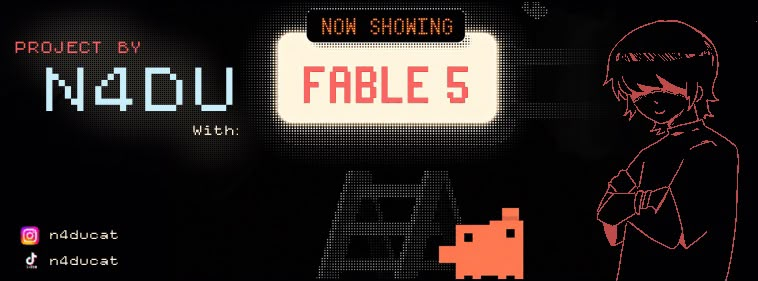

<p align="center">
  
</p>

# ♪ Scrolling Score

Convierte partituras de batería de **MuseScore** en un **video con scroll**
sincronizado al audio real de la canción, con un **editor de sincronización**
que corre en el navegador.

Se cargan las hojas de la partitura (`.mscz`) y el audio de la canción; la app las
renderiza con MuseScore, detecta los golpes del audio y arma un video donde una
línea lectora recorre la partitura al ritmo de la música. Antes de exportar,
la sincronización puede ajustarse a mano en un editor visual.

> **In English:** Scrolling Score turns **MuseScore drum sheet music** (`.mscz`)
> into a **scrolling sheet-music video synchronized with the real song audio**
> — a play-along / practice video where a playhead follows the score in time
> with the recording. It includes a browser-based sync editor (beat-accurate
> alignment, per-note fine-tuning) and exports MP4. Local Flask app; AGPL-3.0.

---

## Requisitos

- **Python 3.10+**
- **MuseScore 3 o 4** instalado (la app lo busca en las rutas estándar; en
  Windows también puede dejarse en `vendor/`; ver `vendor/README.txt`).
- **ffmpeg** en el `PATH` (en Windows puede dejarse en `vendor/ffmpeg.exe`).

Dependencias de Python:

```bash
pip install -r requirements.txt
```

## Cómo se usa

```bash
python main.py
```

Se abre solo el navegador en **http://localhost:5173**. Desde ahí:

1. Sube las hojas de la partitura en `.mscz` (una hoja por archivo, o un
   archivo con varias páginas) y el audio de la canción.
2. La app renderiza las hojas y analiza el audio.
3. En el **editor** alinea la partitura con la canción (arrastrar las tiras,
   clic en un compás para rebobinar, modo `[D]` para afinar pulsos).
4. Exporta el video `.mp4` sincronizado.

### Proyectos (`.sscroll`)

Al terminar de sincronizar, el botón **✓ Listo** del editor abre las opciones
de salida. La casilla **«Guardar también el proyecto»** viene siempre marcada:
junto con el video se descarga un único archivo `.sscroll` (con el nombre de
la canción) que contiene las partituras, el audio, la configuración, la
alineación y las correcciones de pulsos.

Para retomar el trabajo (o continuarlo en otra computadora), arrastra ese
`.sscroll` a la pantalla de inicio: se abre **directamente el editor**, tal
cual quedó al guardarlo — ajusta lo que haga falta y vuelve a generar, sin
realinear nada. La sincronización guardada es independiente de la resolución.

El formato del archivo está **definido y congelado** en
[`docs/FORMATO_SSCROLL.md`](docs/FORMATO_SSCROLL.md): los proyectos guardados
hoy podrán abrirse siempre, sin importar cuánto evolucione la aplicación.

> Está pensado para **hojas de un solo pentagrama** (como las de batería). Las
> partituras multi-pentagrama (piano, cuarteto, coro) no están soportadas y se
> rechazan con un aviso claro.

## Estructura del proyecto

| Archivo | Qué hace |
|---|---|
| `main.py` | Punto de entrada: levanta el servidor y abre el navegador. |
| `app.py` | Servidor Flask: subida, trabajos, progreso (SSE) y editor. |
| `score_engine.py` | Motor: parseo de la partitura, geometría, keyframes y render de cada frame. |
| `musescore_pipeline.py` | Llama a MuseScore para exportar PNG/SVG de cada hoja. |
| `audio_sync.py` | Análisis del audio (detección de golpes / envolvente de onda). |
| `progress.py` | Barras de progreso en consola. |
| `templates/index.html` | Toda la interfaz web (subida + editor de sincronización). |
| `vendor/` | Binarios opcionales para empaquetar en Windows (`ffmpeg.exe`). |
| `build.spec` | Config de PyInstaller para generar el `.exe`. |

## Empaquetar (opcional)

Para generar un ejecutable con PyInstaller:

```bash
pyinstaller build.spec
```

## Licencia

Copyright (C) 2026 **N4DU**

Scrolling Score es software libre bajo la **GNU Affero General Public License
v3.0 (AGPL-3.0)** — ver [`LICENSE`](LICENSE). Puede usarse, estudiarse,
modificarse y compartirse libremente; pero quien distribuya una versión
modificada **o la ofrezca como servicio en red** debe publicar su código
fuente bajo esta misma licencia. Se entrega sin ninguna garantía.

> `vendor/ffmpeg.exe` se distribuye bajo su propia licencia (FFmpeg, LGPL/GPL),
> independiente de la de este proyecto.
